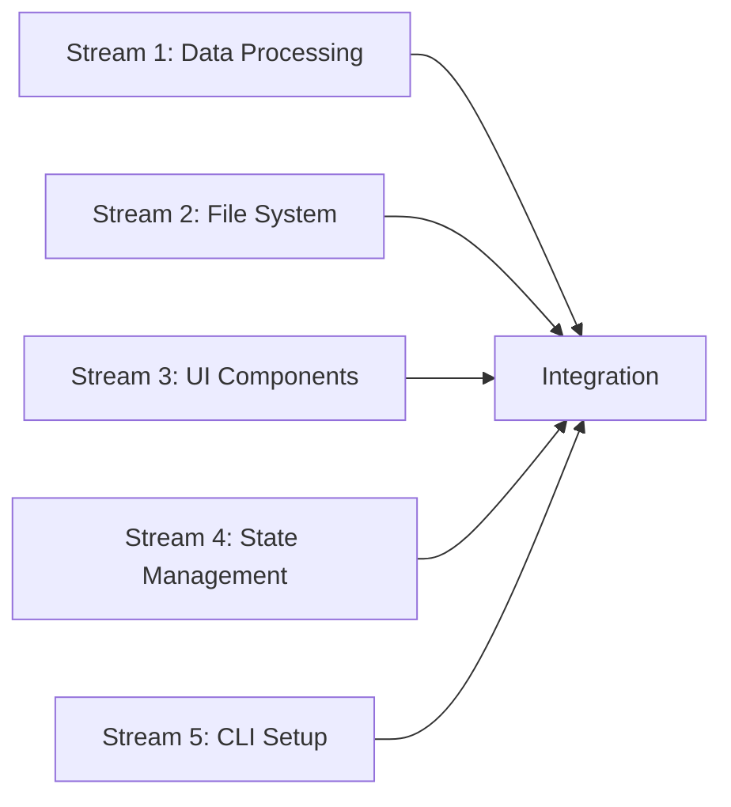

# Parallel Development Plan - Response Time Analyzer

## Overview
This plan outlines how to build the Claude Code Response Time Analyzer using multiple parallel agents/tasks to maximize development efficiency.

## Development Strategy
Split the project into independent modules that can be developed in parallel, with well-defined interfaces between components.

## Parallel Work Streams

### Stream 1: Core Data Processing Pipeline
**Agent Focus**: Backend data processing and calculations

#### Tasks:
1. **JSONL Parser Module** (`src/parser.ts`)
   - Parse Claude Code transcript files
   - Handle malformed JSON gracefully
   - Stream large files efficiently
   - Extract relevant message types

2. **Response Time Calculator** (`src/calculator.ts`)
   - Match user messages with assistant responses
   - Calculate time differences
   - Handle edge cases (no response, interruptions)
   - Return structured response time data

3. **Data Aggregator** (`src/aggregator.ts`)
   - Group response times by day
   - Calculate statistics (total, average, percentiles)
   - Track unique sessions
   - Support multiple aggregation periods

**Interface Output**:
```typescript
interface ProcessedData {
  daily: Map<string, DailyResponseTime>;
  sessions: Map<string, SessionMetrics>;
  summary: SummaryStatistics;
}
```

---

### Stream 2: File System & Data Loading
**Agent Focus**: File discovery and caching system

#### Tasks:
1. **Session Finder** (`src/finder.ts`)
   - Scan ~/.claude/projects directory
   - Map project paths to hyphenated format
   - Find all .jsonl files
   - Support date range filtering

2. **Cache Manager** (`src/cache.ts`)
   - Implement caching for processed data
   - Invalidate cache on file changes
   - Store intermediate results
   - Memory-efficient storage

3. **File Watcher** (`src/watcher.ts`)
   - Monitor for new/updated sessions
   - Emit events for UI updates
   - Debounce rapid changes
   - Handle file system errors

**Interface Output**:
```typescript
interface FileSystemAPI {
  findSessions(options?: FindOptions): Promise<SessionFile[]>;
  watchSessions(callback: WatchCallback): Watcher;
  getCached(sessionId: string): ProcessedData | null;
}
```

---

### Stream 3: Ink UI Components
**Agent Focus**: Interactive terminal UI development

#### Tasks:
1. **Base Components** (`src/components/base/`)
   - `Table.tsx` - Interactive data table
   - `Chart.tsx` - ASCII chart wrapper
   - `ProgressBar.tsx` - Loading indicators
   - `KeyboardHints.tsx` - Help bar

2. **View Components** (`src/components/views/`)
   - `Dashboard.tsx` - Main overview
   - `DateDetails.tsx` - Drill-down view
   - `ExportDialog.tsx` - Export options
   - `Settings.tsx` - Configuration

3. **Layout System** (`src/components/layout/`)
   - `AppShell.tsx` - Main container
   - `TabBar.tsx` - Navigation tabs
   - `SplitPane.tsx` - Resizable panes
   - `StatusBar.tsx` - Status information

**Interface Output**:
```typescript
interface UIComponents {
  Dashboard: FC<DashboardProps>;
  DateDetails: FC<DateDetailsProps>;
  ExportDialog: FC<ExportProps>;
  // ... other components
}
```

---

### Stream 4: State Management & App Logic
**Agent Focus**: Application state and business logic

#### Tasks:
1. **State Manager** (`src/state/`)
   - React Context setup
   - Global state management
   - Action dispatchers
   - State persistence

2. **Navigation Controller** (`src/navigation.ts`)
   - Keyboard input handling
   - View routing
   - Focus management
   - Shortcut system

3. **Export Manager** (`src/export/`)
   - JSON export formatter
   - CSV generator
   - Markdown reports
   - Clipboard integration

**Interface Output**:
```typescript
interface AppState {
  data: ProcessedData;
  ui: UIState;
  settings: Settings;
  dispatch: Dispatch<Action>;
}
```

---

### Stream 5: CLI & Configuration
**Agent Focus**: Command-line interface and setup

#### Tasks:
1. **CLI Parser** (`src/cli.tsx`)
   - Command-line argument parsing
   - Configuration file loading
   - Environment variable support
   - Help documentation

2. **Config Manager** (`src/config.ts`)
   - User preferences
   - Default settings
   - Config file I/O
   - Migration support

3. **Build & Package** (`build/`)
   - Bun build configuration
   - NPM package setup
   - Binary compilation
   - Installation scripts

**Interface Output**:
```typescript
interface CLIOptions {
  from?: Date;
  to?: Date;
  project?: string;
  watch?: boolean;
  config?: string;
}
```

---

## Integration Points & Dependencies

### Phase 1: Independent Development (Parallel)
All 5 streams can start simultaneously with mock data/interfaces:



### Phase 2: Integration Checkpoints

#### Checkpoint 1: Data Pipeline Integration
- Connect Parser → Calculator → Aggregator
- Test with real JSONL files
- Verify output format

#### Checkpoint 2: UI Component Assembly
- Combine base components into views
- Test navigation between views
- Verify responsive layouts

#### Checkpoint 3: State & UI Connection
- Wire components to state management
- Implement data flow
- Test user interactions

#### Checkpoint 4: File System Integration
- Connect finder to data pipeline
- Implement caching layer
- Test watch functionality

#### Checkpoint 5: Final Assembly
- Connect all streams
- End-to-end testing
- Performance optimization

---

## Communication Protocol

### Shared Types (`src/types/index.ts`)
Define all interfaces upfront:

```typescript
// Core data types
export interface TranscriptEntry { /* ... */ }
export interface ResponseTime { /* ... */ }
export interface DailyResponseTime { /* ... */ }

// Component props
export interface DashboardProps { /* ... */ }
export interface TableProps { /* ... */ }

// State types
export interface AppState { /* ... */ }
export interface Action { /* ... */ }
```

### Mock Data Generators (`src/mocks/`)
Each stream creates mock data for testing:

```typescript
// Stream 1 provides:
export const mockProcessedData: ProcessedData = { /* ... */ };

// Stream 2 provides:
export const mockSessionFiles: SessionFile[] = [ /* ... */ ];

// Stream 3 provides:
export const mockUIState: UIState = { /* ... */ };
```

### Integration Tests (`src/tests/integration/`)
Each stream provides integration test suites:

```typescript
// Test data flow
describe('Data Pipeline Integration', () => { /* ... */ });

// Test UI interactions
describe('UI Component Integration', () => { /* ... */ });

// Test file system operations
describe('File System Integration', () => { /* ... */ });
```

---

## Parallel Development Workflow

### 1. Initial Setup (All Agents)
```bash
# Each agent/stream clones and sets up
git clone <repo>
cd cctime
bun install
git checkout -b stream-X-<feature>
```

### 2. Development Phase
Each stream works independently:
- Implements their modules
- Writes unit tests
- Creates mock integrations
- Documents interfaces

### 3. Daily Sync
- Quick standup to discuss progress
- Update shared types if needed
- Resolve any interface conflicts
- Merge completed features to integration branch

### 4. Integration Phase
- Designated integration engineer connects streams
- Run integration tests
- Fix compatibility issues
- Performance testing

---

## Task Assignment Example

### Developer 1: Data Processing Expert
- Owns Stream 1
- Deep knowledge of JSONL parsing
- Performance optimization skills

### Developer 2: React/UI Specialist  
- Owns Stream 3
- Ink component development
- Interactive UI patterns

### Developer 3: System Architecture
- Owns Stream 2 & 4
- File system operations
- State management patterns

### Developer 4: DevOps/Tooling
- Owns Stream 5
- Build systems
- Package distribution

### Developer 5: Integration Lead
- Coordinates between streams
- Manages shared types
- Runs integration tests

---

## Success Metrics for Parallel Development

1. **Independence**: Each stream can run tests without other streams
2. **Interface Stability**: Minimal changes to shared interfaces after initial definition
3. **Parallel Progress**: All streams show daily progress
4. **Clean Integration**: <1 day to connect any two streams
5. **Test Coverage**: Each stream has >80% test coverage

---

## Risk Mitigation

### Interface Mismatches
- Define interfaces early and thoroughly
- Use TypeScript strict mode
- Regular integration tests

### Blocking Dependencies
- Mock all external dependencies
- Use dependency injection
- Implement stub services

### Communication Gaps
- Daily sync meetings
- Shared documentation
- Clear ownership boundaries

### Performance Issues
- Profile each stream independently
- Set performance budgets
- Load test early

---

## Timeline with Parallel Execution

### Week 1
- **Day 1**: Project setup, interface definition (all agents)
- **Day 2-5**: Independent development (parallel)
  - Stream 1: Parser, Calculator implementation
  - Stream 2: File finder, basic caching
  - Stream 3: Base UI components
  - Stream 4: State structure, basic actions
  - Stream 5: CLI parsing, config setup

### Week 2
- **Day 1-2**: First integration checkpoint
- **Day 3-5**: Continue development + fixes
  - Stream 1: Aggregator, statistics
  - Stream 2: File watcher, cache optimization
  - Stream 3: View components
  - Stream 4: Navigation, keyboard handling
  - Stream 5: Build system, packaging

### Week 3
- **Day 1-2**: Second integration checkpoint
- **Day 3-5**: Final features + polish
  - All streams: Bug fixes, optimization
  - Integration team: End-to-end testing

### Week 4
- **Day 1-2**: Final integration
- **Day 3-4**: Performance testing, optimization
- **Day 5**: Documentation, release preparation

This parallel approach can reduce the 4-week timeline to 3 weeks with proper coordination.